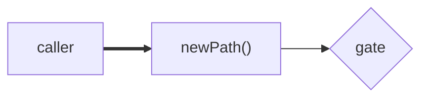

<!-- The reviewer already has the diff, so write down only what the diff cannot
show: X, the problem, and Y, the assumptions and constrained calls behind the road
you took. Anything the code already says belongs in neither section.

Match the medium to the reading. Goal is read, so it is prose plus a diagram that
draws the files, the flow, and the before/after. Key Decisions and the Test Plan are
scanned, so they are lists, and a bold label that states the claim is what makes
them scannable. -->

## Goal

<!-- X in 1-2 sentences: the problem, and why a reviewer should care. Then a mermaid
diagram of what moved - nodes for the files and modules, edges for the flow, `-.->`
for the path removed and `==>` for the one replacing it. Twelve nodes maximum, and
quote any label with punctuation: S["sendEmail()"]. Skip the diagram only when the
change has no shape, such as a version bump.

-->

## Linked Issues

<!-- `Fixes #123` for an issue this PR closes on merge, `Refs #456` for one it
only advances. Add the line of issue context that shapes the work below - the
constraint, the customer, or the call made in the thread. `_none_` when no issue
exists. -->

## Key Decisions

<!-- Y: the calls that shaped the change, one sentence each, as `**claim** - reason`.
The bold half is what a reader could infer from the code; the half after the dash is
what they could not, so a bullet that only restates its own label goes. Scope calls
and a trap with no code site both belong here - give the trap its fix inline. No cap,
and `_none_` when nothing was decided.

- **Hard delete, no soft-delete stage** - applications are triage inbox items, not
  catalog entities, and the audit row is the trail. -->

## Screenshots

<!-- Before/after for any user-visible change. `_n/a - no UI change_` otherwise;
keep the heading either way. -->

## Test Plan

<!-- What you verified by hand: `- [x]` done, `- [ ]` not done or deliberately
skipped. Never restate a check CI already runs - name the manual evidence CI
cannot produce. -->

- [ ]
